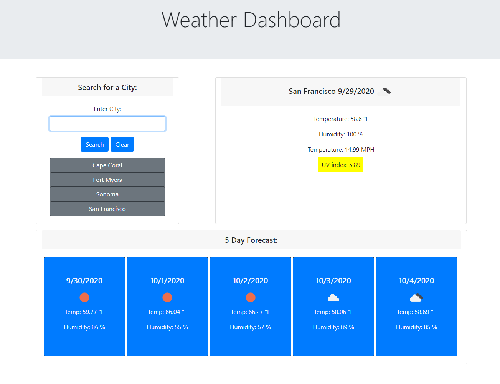

# Weather-Dashboard

## Description
For this project, the goal was to create a weather application in which the user can input a city and receive detailed information about the weather for the current day, as well as a five day future forecast. To begin, I created an HTML file which included bootstrap styling for rows and columns, as well as a jumbotron header. Cards were then added into the rows and columns to host all content on the page. In JavaScript, I first began by adding an Ajax call to OpenWeatherMap.org and viewed the response object in the Chrome inspect tool to find the weather data needed to populate the site. After finding the location of the necessary data, I used Jquery to style and add elements to the page, and changed the text in those elements to the data returned from OpenWeatherMap. To add the UV information and the five day forecast section, I created two separate functions that both use information pushed from the search function in order to make two new Ajax calls to locate that information. The uvDisplay function uses latitude and longtitude to grab the UV index, and if statements to deterimine the background color of the element displaying it. The fiveDay function grabs the date, an icon displaying weather for that day, the temperature and humidity for the next five days and adds them to the cards at the bottom of the page. 

I then added a function to grab the user input text when the user clicks the search button, add that text to an array, and send that text to the search function. I also added error checking to make sure that the user did not include the same city twice, or click the search button without entering anything. If the Ajax call returns an error, the user will be alerted that the API is having connection issues or the city they entered does not exist. After getting a response from the Ajax call, the city the user inputs is then added to an array, which is also added to local storage. The city is also added to a button that can be clicked to display the weather of that city again. To finish, I also added a function that loads all previously entered cities from local storage and displays them as buttons when the page is opened. 

 

## Table of Contents
* [Installation](#installation)
* [Usage](#usage)
* [Built With](#built_with)
* [Deployed Link](#deployed_link)
* [Author](#author)
* [Images](#images)
* [License](#license)
* [Acknowledgments](#Acknowledgments)

## Installation
To launch this site, I created a repository on github and utilized github pages to host it.

## Usage
This application is designed to display the current weather and five day forecast for a given city. A user can enter a city in the input field, click search and be presented with weather information. Entered cities that return a result will be saved to local storage, present as buttons, and will remain on page refresh.

## Built_With
* JavaScript
* [Openweathermap](https://openweathermap.org/)
* HTML
* [Bootstrap](https://getbootstrap.com/)
* CSS
* [Github](https://github.com/)

## Deployed_Link
[Weather Dashboard](https://jsp117.github.io/Weather-Dashboard/)

## Author
Jonathan SanPedro - Bachelors of Information Technology at Rutgers New Brunswick - Student at Berkeley Coding Bootcamp

* [Github](https://github.com/jsp117)
* [LinkedIn](https://www.linkedin.com/in/jonathan-s-6ab32283/)

## Images

## License

MIT License

Copyright (c) [2020] [Jonathan J. SanPedro]

Permission is hereby granted, free of charge, to any person obtaining a copy
of this software and associated documentation files (the "Software"), to deal
in the Software without restriction, including without limitation the rights
to use, copy, modify, merge, publish, distribute, sublicense, and/or sell
copies of the Software, and to permit persons to whom the Software is
furnished to do so, subject to the following conditions:

The above copyright notice and this permission notice shall be included in all
copies or substantial portions of the Software.

THE SOFTWARE IS PROVIDED "AS IS", WITHOUT WARRANTY OF ANY KIND, EXPRESS OR
IMPLIED, INCLUDING BUT NOT LIMITED TO THE WARRANTIES OF MERCHANTABILITY,
FITNESS FOR A PARTICULAR PURPOSE AND NONINFRINGEMENT. IN NO EVENT SHALL THE
AUTHORS OR COPYRIGHT HOLDERS BE LIABLE FOR ANY CLAIM, DAMAGES OR OTHER
LIABILITY, WHETHER IN AN ACTION OF CONTRACT, TORT OR OTHERWISE, ARISING FROM,
OUT OF OR IN CONNECTION WITH THE SOFTWARE OR THE USE OR OTHER DEALINGS IN THE
SOFTWARE.

## Acknowledgments
[Openweathermap.org](https://openweathermap.org/)

